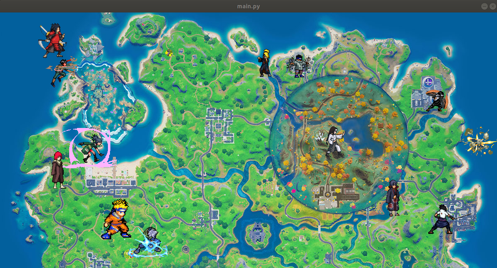
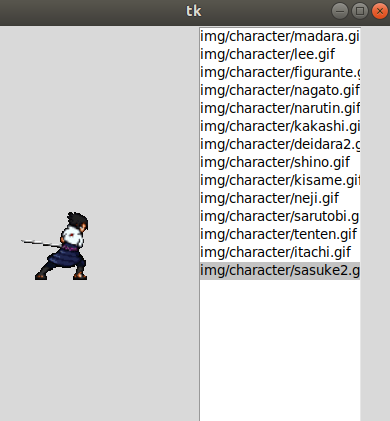
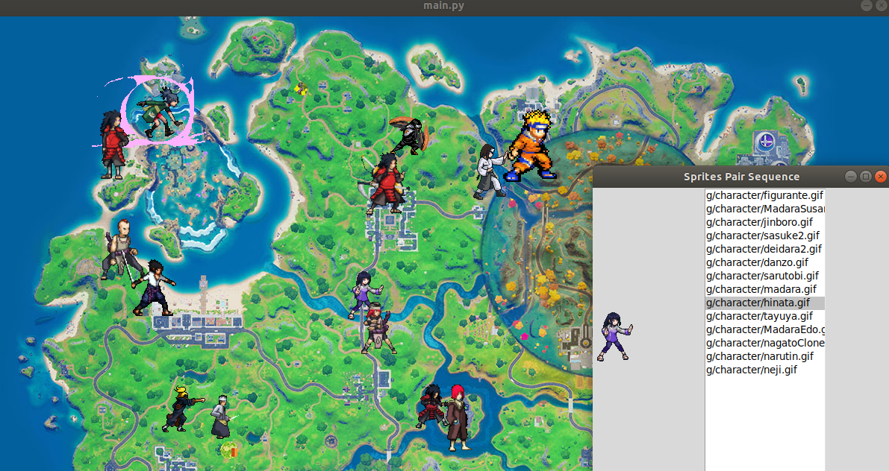

# DP(n): Duplas Pros ninja

**Número da Lista**: 5 
**Conteúdo da Disciplina**: Programação Dinâmica 

## Alunos
|Matrícula | Aluno |
| -- | -- |
| 17/0033112  |  Eugênio Sales |
| 17/0138551  |  Bruno Duarte |

## Sobre 
O projeto sobre programação dinâmica é uma adaptação ou evolução da questão [***10911 - Forming Quiz Teams***](https://onlinejudge.org/index.php?option=onlinejudge&page=show_problem&problem=1852)  que aborda justamente uma forma de contabilizar a menor soma/custo de distâncias euclidianas entre os pontos distribuídos. Para contextualizar essa questão foi traçado um plano 2D onde serão disponibilizados sprites de personagens em 8 bits para serem distribuídos neste plano conforme mostrado no vídeo.

## Adaptação do Problema
O mundo atual está passando pela Primeira Grande Guerra Ninja! Você tem acesso ao mapa Fortnight e ficou responsável por informar a localização de cada um dos ninjas no campo de batalha e indicar qual será o melhor pareamento de pares possível para que cada dupla possa atacar simultaneamente as bases inimigas e acabar de vez com essa guerra.

## Screenshots

## Instalação 
**Linguagem**: Python 
**Framework**: pyglet, tkinter 
* Pyglet
* Tkinter

## Uso 
Após efetuar o download dos requisitos 

> python3 main.py

> Distribuir 2*N personagens nos pontos desejados dentro do "mapa" Onde ***1 <=N<=15*** é o valor de pares disponíveis que pode ser definido na linha 18 do código main.py (default = 7) 

> Após distribuir a quantidade necessária irá abrir uma janela que informar uma lista com as duplas separadamente no plano.

## Outros 
* O algoritmo pode dar algumas travadas durante o periodo de conclusão da dupla

* **Não** clicar no mesmo ponto para inserir os personagens

* Devido ao uso de multiprocessing pode gerar algumas adversidades na execução/fechamento das abas 

